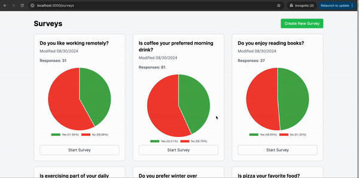

# Survey Application

Welcome to the Survey Application! This application allows users to create surveys, respond to them with a simple Yes or No, and view the results in a visually appealing way.

## Demonstration




## Stack

This application is built with the following technologies:

- **Ruby**
- **Rails**
- **RSpec**
- **Tailwind CSS**
- **Chartkick** (A Ruby gem for creating beautiful JavaScript charts with minimal effort)

### Application Architecture

The main codebase is organized into the following units, each responsible for a specific part of the application:

1. **CreateSurvey**: Handles the creation of new surveys.
2. **CreateSurveyResponse**: Manages the responses submitted by users for each survey.
3. **UpdateSurveyResult**: Updates the survey results based on the responses received.

## How to Run the Application

Follow these steps to set up and run the application locally:

1. **Install Dependencies**:

Make sure you have all the necessary dependencies installed by running:

```bash
bundle install
```

2. **Set Up the Database:**:

Run the database migrations to create the necessary tables:

```bash
rails db:migrate
```

Optionally, you can seed the database with sample data:

```bash
rails db:seed
```

3. **Start the Development Server:**:

Use the following command to start the server with Tailwind and other assets precompiled:

```bash
bin/dev
```

4. **Access the Application::**:

Open your web browser and visit:

```bash
http://localhost:3000
```

You should now be able to view and interact with the Survey Application!

## Testing

The application is fully tested using RSpec. To run the test suite, simply use:


```bash
bundle exec rspec
```

## Code Quality

To run RuboCop, use:

```bash
bundle exec rubocop
```
